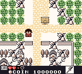
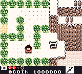

 

# Frog Color v0.2

An IPS color patch for the Game Boy Color build of **Kaeru no Tame ni Kane wa Naru**. It adds color to overworld scenery, makes water blue, and gives the character red clothing in standing, crouching, and jumping poses while keeping white eye highlights in the relevant frames.

## Apply the patch

1. Start with the exact 512 KiB base ROM named `frog-color-v3.1-original.gb` (SHA-256: `090484629447662ecf0edb60268af0593f1369764f78ce92903839b0d05f6f80`). This patch is for that existing color build, not an unmodified retail ROM.
2. Apply [`frog-color-v0.2.ips`](frog-color-v0.2.ips) with an IPS patcher.
3. Open the resulting `.gb` file in Game Boy Color mode.

The patched ROM should have SHA-256 `7596a497e78c2014fed0c101d36768b65ec6f50f593946ac52c5980af898274b`.

If an emulator resumes an older save state, change areas or restart from an in-game save to reload the updated colors.
